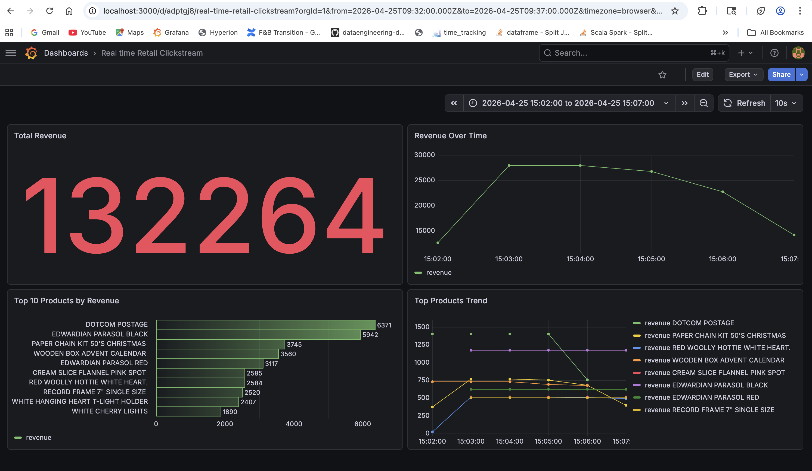

# Overview:-

This project implements a production-style real-time data pipeline for e-commerce clickstream analytics. It ingests transactional data, processes it in near real-time, stores it in an analytics database, and visualizes insights via a live dashboard.

The pipeline simulates systems used by companies like Flipkart, Meesho, and Myntra for real-time business monitoring.

# Architecture

```properties
CSV Dataset → Kafka Producer → Kafka Topic
                              ↓
                        PySpark Streaming
                              ↓
                      Aggregations (Windowed)
                              ↓
                        Apache Druid
                              ↓
                          Grafana
```

# Tech Stack

- Apache Kafka → Event streaming 
- PySpark Structured Streaming → Real-time processing 
- Apache Druid → OLAP analytics database 
- Grafana → Visualization & dashboards 
- Python → Data generation & orchestration

# Dataset

- I referred to this dataset from [Kaggle](https://www.kaggle.com/code/olgaluzhetska/online-retail-cohort-analysis-and-other-stories/input)
- The dataset contains retail transaction data with fields like:
  - **InvoiceNo:-** Nominal. A 6-digit integral number uniquely assigned to each transaction.
  - **StockCode (Product ID):-** Nominal. A 5-digit integral number uniquely assigned to each distinct product.
  - **Description (Product Name):-** Product (item) name. Nominal.
  - **Quantity:-** The quantities of each product (item) per transaction. Numeric.
  - **InvoiceDate:-** Invoice date and time. Numeric. The day and time when a transaction was generated.
  - **UnitPrice:-** Unit price. Numeric. Product price per unit in sterling (£).
  - **CustomerID:-** Customer number. Nominal. A 5-digit integral number uniquely assigned to each customer.
  - **Country:-** Country name. Nominal. The name of the country where a customer resides.
  
## Local Implementation
This entire pipeline was built and tested fully on a local machine for learning and experimentation purposes. **This can be used as a follow along if you are also learning.**

#### Local Setup Includes:
- Kafka (single-node, KRaft mode)
- PySpark (local execution)
- Apache Druid (micro-quickstart mode)
- Grafana (local service)
- Data stored in local filesystem (/tmp/druid)

This setup simulates a real pipeline but runs in a single-node environment

### Limitations of Local Setup
- No distributed processing
- Limited scalability
- Single point of failure
- Small data volumes only
- Manual ingestion steps (batch spec for Druid)

### Production systems include:
- Schema Registry (Avro/Protobuf)
- Dead Letter Queues (DLQ)
- Monitoring & alerting 
- Fault-tolerant ingestion 
- Horizontal scaling

## Kafka Setup & Data Ingestion

Download Kafka in local using the below link:-
https://dlcdn.apache.org/kafka/4.2.0/kafka_2.13-4.2.0.tgz ([KafkaOrg](https://www.apache.org/dyn/closer.cgi?path=/kafka/4.2.0/kafka_2.13-4.2.0.tgz))

```shell
$ tar -xzf kafka_2.13-4.2.0.tgz
$ cd kafka_2.13-4.2.0
# Generate a Cluster UUID
$ bin/kafka-storage.sh random-uuid ## output like: abcd1234-5678-xxxx-yyyy-zzzzzz
# Format Log Directories, give about output in cluster_id
$ bin/kafka-storage.sh format \
  -t <YOUR_CLUSTER_ID> \
  -c config/kraft/server.properties
  --standalone
# Start the Kafka Server
$ bin/kafka-server-start.sh config/server.properties
```

- This creates a unique identifier for your Kafka cluster. 
- Kafka (in KRaft mode) requires a cluster ID to bind all brokers together logically. 
- Think of it like a unique name/identity for the cluster.

```KAFKA_CLUSTER_ID="$(bin/kafka-storage.sh random-uuid)"```

This is the important initialization step.

- `format` → Prepares Kafka’s log directories (like formatting a disk). 
- `-t $KAFKA_CLUSTER_ID` → Assigns the cluster ID you just generated. 
- `-c config/server.properties` → Uses your broker config to know:
  - Where logs are stored (`log.dirs`)
  - Node ID, roles, etc. 
- `--standalone` → Indicates you're running a single-node KRaft setup (no multi-node quorum).

```commandline
$ bin/kafka-storage.sh format \
-t $KAFKA_CLUSTER_ID \ 
-c config/server.properties \
--standalone 
```
- When we create new cluster_id and wanted to delete the old one use the command:-
`rm -rf /tmp/kraft-combined-logs`
- Start kafka:- 
  - `bin/kafka-server-start.sh config/server.properties` (keep this running)
- Create Topic:-
```commandline
$ bin/kafka-topics.sh --create \
  --topic retail-events \
  --bootstrap-server localhost:9092 \
  --partitions 3 \
  --replication-factor 1
  ```
- Start Consumer:-
```commandline
$ bin/kafka-console-consumer.sh \
  --topic retail-events \
  --from-beginning \
  --bootstrap-server localhost:9092
```
- Start Producer:-
```commandline
$ bin/kafka-console-producer.sh \
  --topic retail-events \
  --bootstrap-server localhost:9092
```
Type: `hello` (If consumer prints it → Kafka is working)

### Real-Time Kafka stream

- Considering we need to emulate real-time kafka for our use case, we want the data to flow from the CSV file as a real time data.
- There is a program written in the to produce this data in real time which has csv as the input.
- `python csv_kafka_producer.py`

## Spark Structured Streaming

### Real-Time Stream Ingestion with PySpark Structured Streaming
- In this step, we build the stream processing layer by integrating Apache Spark Structured Streaming with Kafka.
- The streaming job continuously consumes clickstream events from the Kafka topic (`retail-events`) and converts raw JSON messages into a structured schema.
```commandline
$ spark-submit \
--packages org.apache.spark:spark-sql-kafka-0-10_2.13:4.1.1 \
kafka_spark_stream.py
```
- Expected results should be as below:-
```properties
-------------------------------------------
Batch: 1
-------------------------------------------
+----------+----------+--------------------+--------+-------------------+----------+-----------+--------------+
|invoice_no|product_id|        product_name|quantity|         event_time|unit_price|customer_id|       country|
+----------+----------+--------------------+--------+-------------------+----------+-----------+--------------+
|    489434|     85048|15CM CHRISTMAS GL...|      12|2009-12-01 07:45:00|      6.95|    13085.0|United Kingdom|
```

#### Notes (for local) :-
- Make sure to run `csv_kafka_producer.py` after the spark-submit so that the spark-stream can read the records that the consumer is producing.
- Also make sure the `Kafka Server` is also running.
- Running in PyCharm, give environment-variables:-
`PYSPARK_SUBMIT_ARGS=--packages org.apache.spark:spark-sql-kafka-0-10_2.13:4.1.1 pyspark-shell`

# Druid

- We need to sink data into druid. Because we are doing everything locally, let us install druid in our local system. Please use the below link:-
https://dlcdn.apache.org/druid/36.0.0/apache-druid-36.0.0-bin.tar.gz ([DruidOrg](https://www.apache.org/dyn/closer.cgi?path=/druid/36.0.0/apache-druid-36.0.0-bin.tar.gz))
```shell
$ tar -xvf apache-druid-*.tar.gz
$ cd apache-druid-*
$ bin/start-micro-quickstart
```
- You should be able to open in local: http://localhost:8888/unified-console.html
- Spark does not have a native Druid Sink.
- So we will be using HTTP ingestion API.

# Grafana

- `brew install grafana`
- `brew services start grafana` -> Starts Grafana
- `brew services stop grafana` -> Stops Grafana
- Open this link:- http://localhost:3000/dashboards (For local dev:- Username: admin, Password: admin)
- Connections -> Data Sources -> Add data source (select Apache Druid, fill URL: http://localhost:8888)
- Under Dashboard -> Add new panel
- Below are the queries:-
```properties
# Total Revenue

SELECT SUM(total_revenue) AS total_revenue
FROM clickstream_batch

# Top 10 Products by Revenue

SELECT
  product_name,
  SUM(total_revenue) AS revenue
FROM clickstream_batch
GROUP BY product_name
ORDER BY revenue DESC
LIMIT 10

# Revenue over time

SELECT
  TIME_FLOOR(__time, 'PT1M') AS "__time",
  SUM(total_revenue) AS revenue
FROM clickstream_batch
GROUP BY TIME_FLOOR(__time, 'PT1M')
ORDER BY "__time"

# Top Products Trend

SELECT
  TIME_FLOOR(__time, 'PT1M') AS "__time",
  product_name,
  SUM(total_revenue) AS "revenue"
FROM clickstream_batch
WHERE product_id IN (
  SELECT product_id
  FROM clickstream_batch
  GROUP BY product_id
  ORDER BY SUM(total_revenue) DESC
  LIMIT 8
)
GROUP BY TIME_FLOOR(__time, 'PT1M'), product_name
ORDER BY "__time"
```


